# Usecase 01 - Create a Knowledge Assistant agent for HR in Copilot Studio  that leverages Azure AI Search

## Overview

A large enterprise wants to reduce the time employees spend searching
for HR-related information (policies, benefits, leave guidelines, etc.)
spread across SharePoint, PDFs, internal wikis, and documents.

To overcome this issue, in this lab, you will build a **Knowledge
assistant** **agent** in **Copilot Studio** that uses **Azure AI
Search**, to index and semantically search across enterprise HR
documents.

## Lab Objective

- Exercise 1: Create an Azure AI Search resource
- Exercise 2: Create a Storage account
- Exercise 3: Create an Azure OpenAI Service and deploy a model
- Exercise 4: Create a vector index
- Exercise 5: Create a knowledge assistant agent
- Exercise 6: Add the Azure AI Search as a knowledge source

## Exercise 1: Create an Azure AI Search resource

In this exercise, you will create an Azure AI Search resource from the
Azure portal. This will be used to search the documents using AI
capability.

**Azure AI Search** is a cloud-based service for searching within your
privately curated data. It uses a combination of Microsoft’s AI and
JSON-based indexes to provide fast, relevant search results.

1. In the Azure portal, go to the **top search bar**, enter **Microsoft Foundry (1)**, and from the results, choose **Microsoft Foundry (2)** under the **Services**.

    

1. In the **Microsoft Foundry** page, expand **Use with Foundry (1)**, select **AI Search (2)**, and then click **+ Create (3)** to begin creating a new AI Search resource.

    

1. On the **Create a search service** page under the **Basics** tab, provide the following details:

     - Select the **Resource group** as **AgenticAI (1)** from the dropdown.
     - Enter **Service name**  as **searchleaves-<inject key="DeploymentID" enableCopy="false"/> (2)**.
     - Choose the appropriate **Location (3)** based on your region or lab requirement.
     - Verify that the **Pricing tier (4)** is set to **Standard** (default selection).
     - Click on **Review + create (5)** to validate the configuration and proceed with deployment.

        

1. On the **Review + create** tab, verify all the configured settings and then click **Create** to deploy the AI Search service.

     

1. Once the deployment is complete, click on **Go to resource** to navigate to the newly created AI Search service.

     

1. On the AI Search service **Overview** page, locate the **URL** under the **Essentials** section and click the **copy icon** next to it to copy the service endpoint for later use.

     

1. In the AI Search service, navigate to **Security + networking**, select **Keys (1)**, and under **Manage admin keys**, click the **copy icon (2)** next to the **Primary admin key** to copy it for later use.

    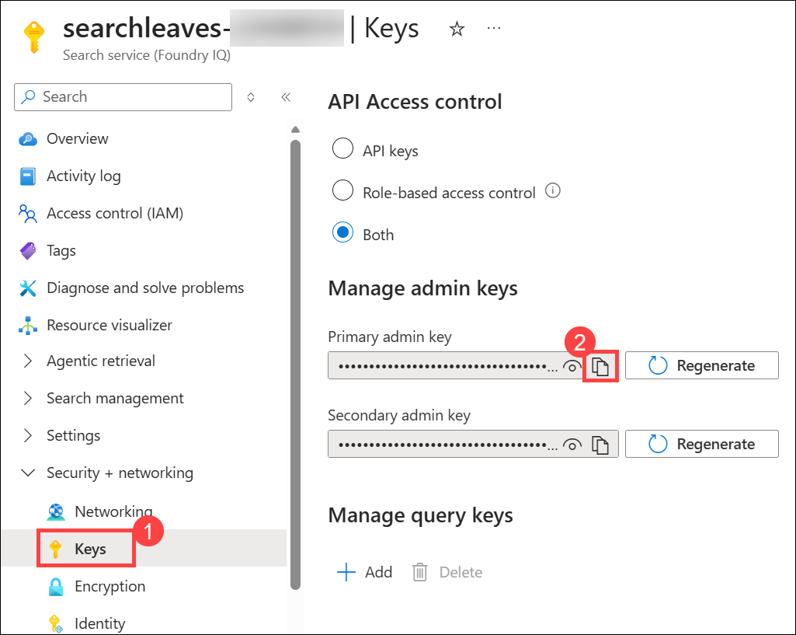 

1. In the AI Search service, go to **Identity (1)**, switch the **Status** to **On (2)** to enable the system-assigned managed identity, and then click **Save** to apply the changes.

    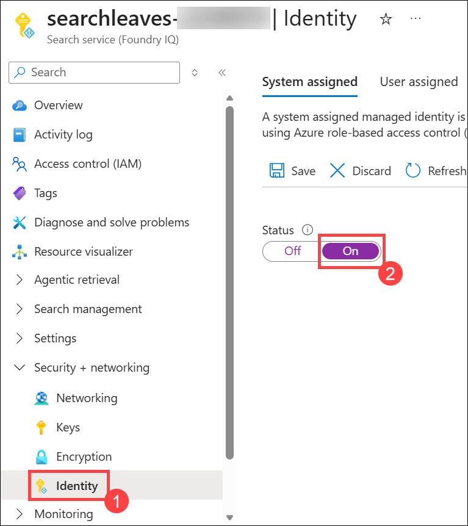 

1. In the confirmation dialog to enable the system-assigned managed identity, click **Yes** to proceed and register the identity with Microsoft Entra ID.

    

## Exercise 2: Create a Storage account

1. In the Azure portal, go to the **top search bar**, enter **Storage accounts (1)**, and from the results, choose **Storage accounts (2)** under the **Services**.

    

1. On the **Storage accounts** page, click **+ Create** to begin creating a new storage account.

    

1. On the **Create a storage account** page under the **Basics** tab, configure the required settings as follows:

    - Select **Resource group**: **AgenticAI (1)**
    - Enter **Storage account name** as **leavepolicystg (2)<inject key="DeploymentID" enableCopy="false"/>**
    - Choose **Region (3)**
    - Set **Preferred storage type**: **Azure Blob Storage or ADLS Gen2 (4)**
    - Keep **Performance**: **Standard (5)**
    - Set **Redundancy**: **LRS (6)**
    - Click **Review + create (7)**

      

1. On the **Review + create** tab, verify all the configured storage account settings and click **Create** to deploy the storage account.

    

1. Once the deployment is complete, click **Go to resource** to open the newly created storage account.

    

1. In the storage account, navigate to **Data storage (1)**, select **Containers (2)**, and then click **+ Add container (3)** to create a new container.

    

1. In the **New container** pane, enter **document (1)** as the **Name**, keep the access level as **Private**, and click **Create (2)** to create the container.

    

1. After the container is created, locate and select the **document** container from the list to open it.

    

1. In the **document** container, click **Upload (1)**, then in the upload pane select **Browse for files (2)**, navigate to **C:\LabFiles\lab file**, select the **LeavePolicy.docx**  and then click on **Upload**..

    

1. In the storage account, navigate to **Access Control (IAM) (1)**, click **+ Add (2)**, and select **Add role assignment (3)** to begin assigning permissions.

    

1. In the **Add role assignment** pane, search for **Storage Blob Data Reader (1)**, select the **role (2)** from the list, and click **Next (3)** to proceed.

    

1. In the **Members** tab, keep **Assign access to** as **User, group, or service principal (1)**, click **Select members (2)**, **search (3)** and **choose (4)** the ODL user **<inject key="AzureAdUserEmail"></inject>**, click **Select (5)** and then proceed.

    

1. In the **Members** tab, select **Managed identity (1)**, click **Select members(2)**, choose **Search service (3)** from the managed identity dropdown, select your **AI Search service instance (4)**, and proceed to assign it.

    

1. In the **Add role assignment** pane, verify that both the required user and the **Search service managed identity** are listed under **Members (1)**, then click **Review + assign (2)** twice to complete the role assignment.

    

In this exercise, we have created a Storage account and added the
document and required Role permissions to it.

## Exercise 3: Create an Azure OpenAI Service and deploy a model

1. In the Azure portal search bar, type **Azure OpenAI (1)**, then select **Azure OpenAI (2)** from the **Services** list to open it.

    

1. In the **Azure OpenAI** page, click **+ Create (1)** and then select **Azure OpenAI (2)** from the dropdown to begin creating a new resource.

    

1. In the **Create Azure OpenAI** page, select **Resource group** as **AgenticAI (1)**, choose the **Region (2)**, enter **Name** as **openaiservice-<inject key="DeploymentID" enableCopy="false"/> (3)**, keep the **Pricing tier** as **Standard S0 (4)**, and click **Next (5)** option **thrice** to proceed.

    

1. On the **Review + submit** tab, verify all the configured details and click **Create** to deploy the Azure OpenAI resource.

    

1. Once the deployment is complete, click **Go to resource** to open the Azure OpenAI resource.

    

1. In the Azure OpenAI resource, navigate to **Access control (IAM) (1)**, click **+ Add (2)**, and select **Add role assignment (3)** to assign permissions.

    

1. In the **Add role assignment** pane, search for **Cognitive Services OpenAI User (1)**, select the role from the **list (2)**, and click **Next (3)** to continue.

    

1. In the **Members** tab, keep **Assign access to** as **User, group, or service principal (1)**, click **Select members (2)**, **search (3)** and **choose (4)** the ODL user **<inject key="AzureAdUserEmail"></inject>**, then click **Select (5)** and proceed.

    

1. In the **Members** tab, select **Managed identity (1)**, click **Select members (2)**, choose **Search service (3)** from the managed identity dropdown, select your **AI Search service instance (4)**, and proceed.

    

1. In the **Add role assignment** pane, verify that both the required user and the **Search service managed identity** are listed under **Members (1)**, then click **Review + assign (2)** twice to complete the role assignment.

    

1. Navigate to the **Overview** page, click **Go to Foundry portal** to open the service in Microsoft Foundry.

    

1. On the Create a project pop-up, keep all the details default and click on **Create**.

    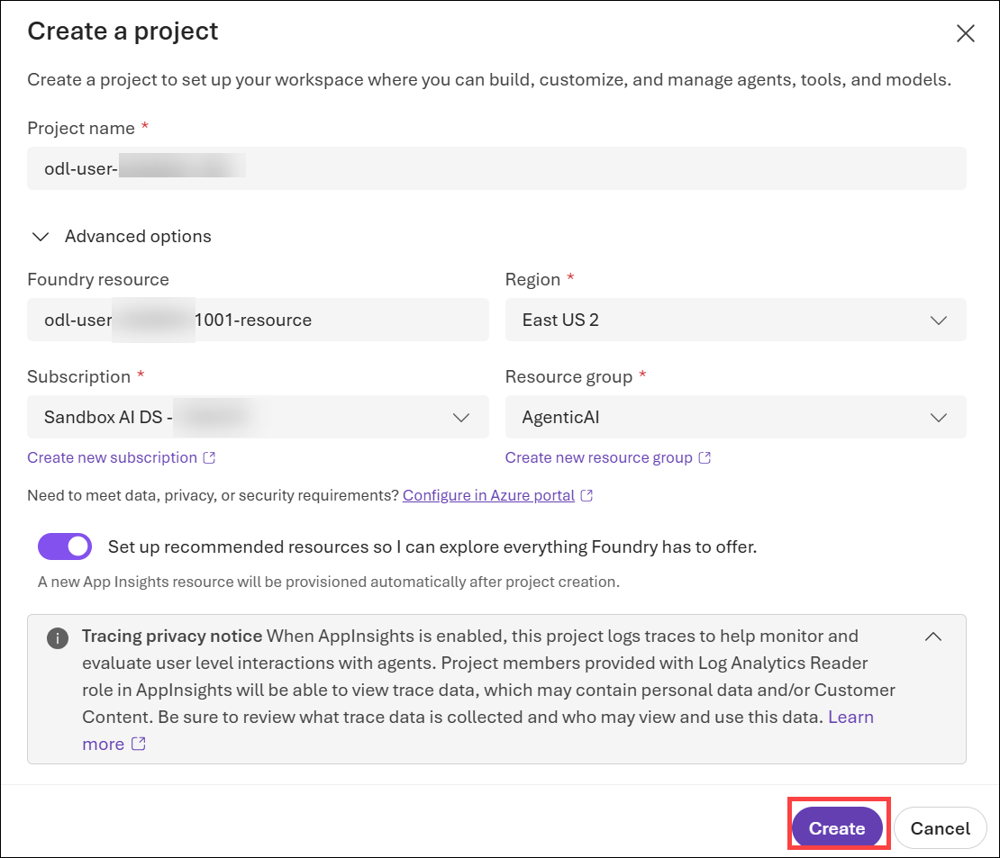 

1. On the Your project is set up pop-up, click on **Skip**.

    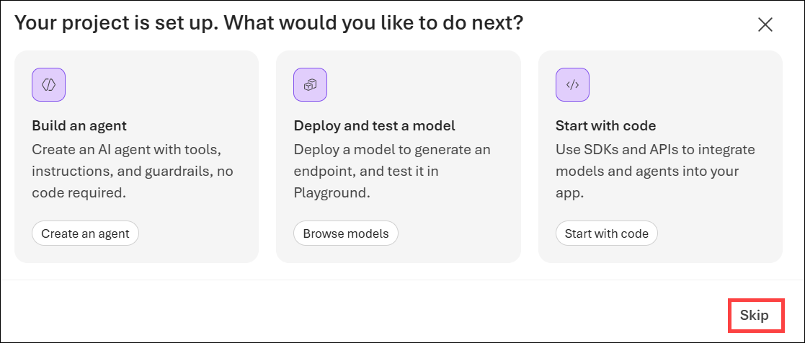 

1. Click on **Discover** from the top menu.

    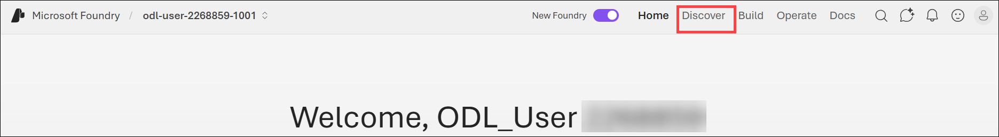 

1. Select **Models (1)** from the left navigation pane, search for **text-embedding-3-large (2)**, select the model from the **list (3)**.

    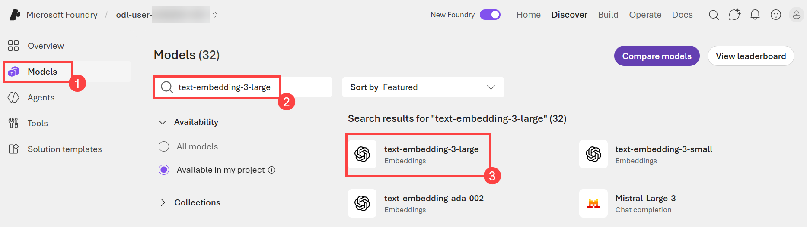 

1. Click on the **Deploy (1)** dropdown button and select **Custom settings (2)**.

    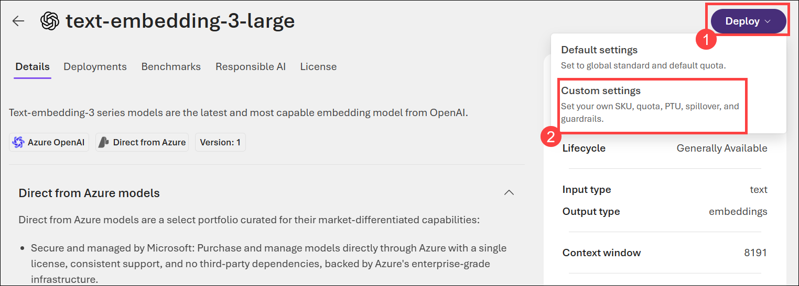 

1. In the **Deploy text-embedding-3-large** pane, keep the **Deployment type** as **Standard (1)** and click **Deploy (2)** to create the model deployment.      

    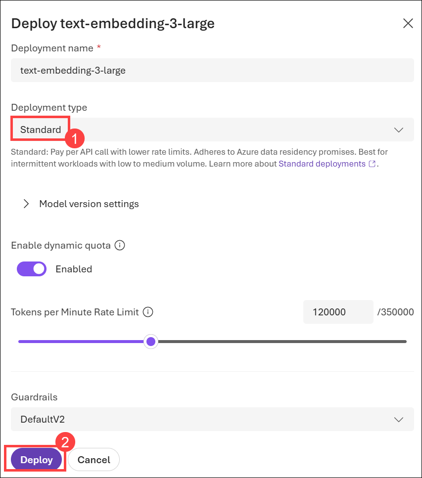 

   ### Congratulations!

   You’ve completed the task. Now let’s validate it:
     
   - Hit the **Validate** button for the corresponding task.
   - If successful, proceed to the next task.
   - If not, retry using the lab guide.
   - Need help? cloudlabs-support@spektrasystems.com
   <validation step="84aae3c9-71f4-401e-a136-f446d2da1749" />

## Exercise 4: Create a vector index

1. In the Azure portal search bar, type **AI Search (1)**, then select **AI Search (2)** from the Services list to open it and click on the **searchleaves (3)**.

1. On the AI Search service page, click **Import data** to start importing data into the search index.

    

1. In the **Import data** pane, select **Azure Blob Storage** as the data source to proceed with importing data.

    

1. In the **Import data** workflow, select **RAG** as the scenario to enable AI-powered search over your data.

    

1. In the **Configure your Azure Blob Storage** step, select * **leavepolicystg<inject key="DeploymentID" enableCopy="false"/> (1)** for the **Storage account**, choose the **Blob container** as **document (2)**, and click **Next (3)** to proceed.

    

1. In the **Vectorize your text** step, configure the following:

    - Set **Kind** to **Microsoft Foundry (1)**
    - Select your **Subscription (2)**
    - Choose the **Microsoft Foundry Project (3)**
    - Set **Model deployment** to **text-embedding-3-large (4)**
    - Select **System assigned identity (5)** for authentication
    - Select the **"I acknowledge..."** checkbox
    - Click **Next (6)** to proceed

         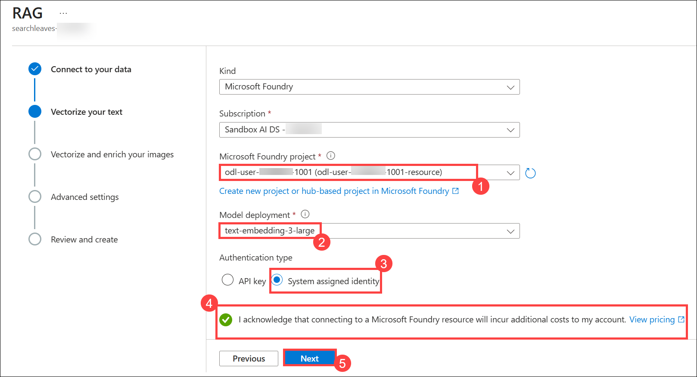

1. In the **Vectorize and enrich your images** step, leave the default options unchanged (no selection) and click **Next** to proceed.

    

1. In the **Advanced ranking and relevancy** step, leave the default options unchanged (no selection) and click **Next** to proceed.

    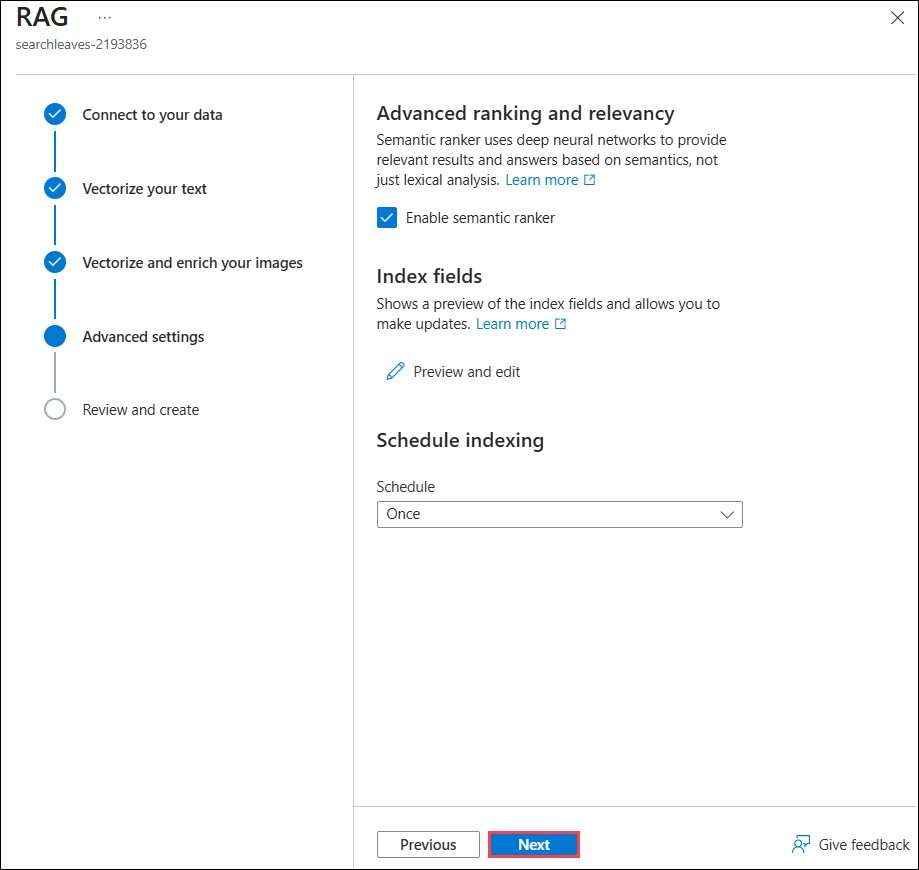

1. In the **Review and create** step, verify the configuration details and click **Create** to complete the RAG setup.

    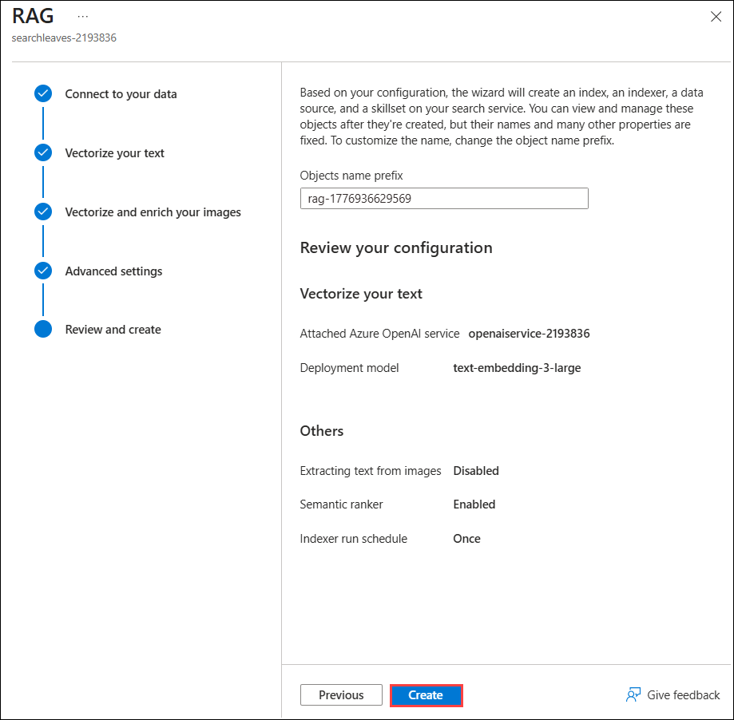

1. Once the setup is complete, click **Close** to view and test your indexed data.

    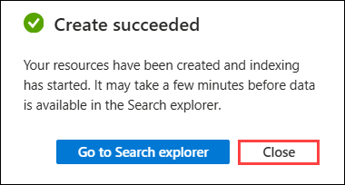       

   ### Congratulations!

   You’ve completed the task. Now let’s validate it:
     
   - Hit the **Validate** button for the corresponding task.
   - If successful, proceed to the next task.
   - If not, retry using the lab guide.
   - Need help? cloudlabs-support@spektrasystems.com
   <validation step="77d3c91e-95a7-41d5-a2dc-5ee605b4ef21" />

## Exercise 5: Create a knowledge assistant agent

1. In a new tab, enter the following URL to open **Microsoft Copilot Studio** using your login credentials.

    ```
    https://copilotstudio.microsoft.com
    ```

1. Select **Get Started** in the Welcome to Microsoft Copilot Studio.

    

1. Enter the following agent description prompt in the prompt box to define your agent’s purpose and click Send.

    ```
    You are a Knowledge assistant agent for HR who will answer questions related to leaves and leave policies to the employees.
    ```

      

1. Click on **Test (1)** from the top-right corner, then enter following **prompt (2)** and click send to validate your agent’s response.

    ```
    How many days of Maternity leaves can I avail?
    ```

      

1. It gives a generalized response as shown in the screenshot below.

    

## Exercise 6: Add the Azure AI Search as a knowledge source

1. From the **Overview** page of the agent, select **Add knowledge**.

    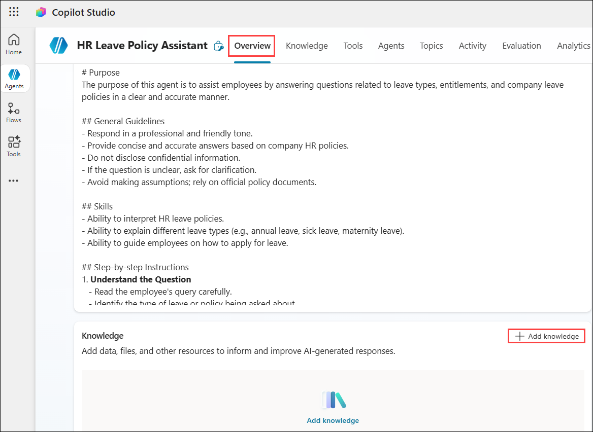

1. Select Azure AI Search from the list of knowledge sources available.

    

1. Click on the **drop down** next to **Not connected** in the next screen and select **Create new connection**.

    

1. Enter the **Endpoint url** and the **Admin key** values which we saved to a notepad in a previous exercise and then click on **Create** to create the connection.

    

1. Once the connection is established, the available index is listed and already selected. Click on **Add to agent**.

    

1. The AI Search service is added as a knowledge source to the agent and is in **Ready (1)** state now. Ensure that the **Web search** option is **disabled (2)** in the Knowledge section.

    

1. Now, let us test the agent with the same question we tried before.

1. Click **New test session**, enter your query, and review the generated response to verify the agent’s accuracy.

    ```
    How many days of Maternity leaves can I avail?
    ```

1. You can see that the response from the agent now is from the document uploaded in the AI Search service.

    

## Important

   > **Note**: Please delete the resources that you have created in the **AgenticAI** resource group. 

   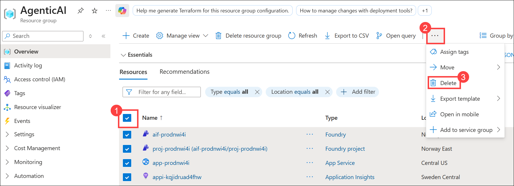 

## Summary

In this lab, we have learnt to connect the agent to a Azure AI Search
service as a knowledge source and test the agent based on the source.

