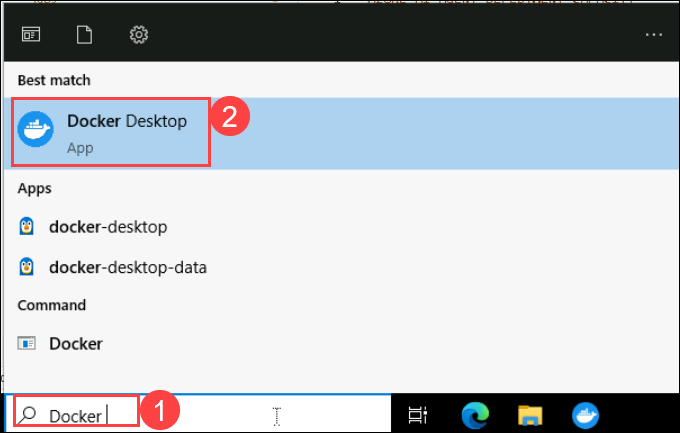
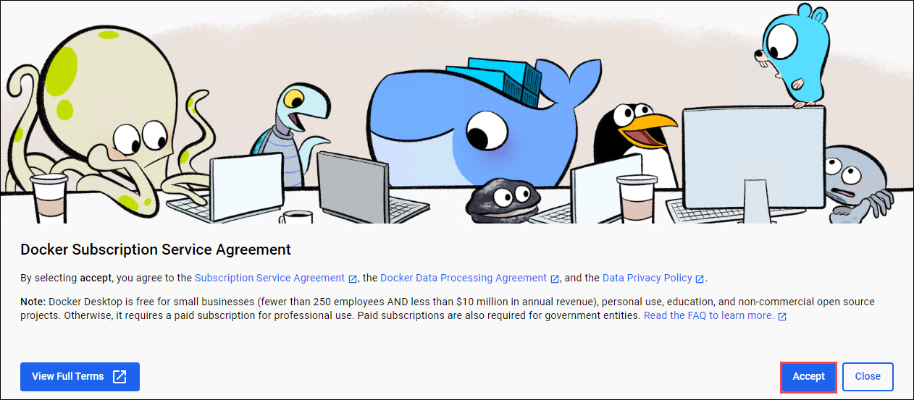
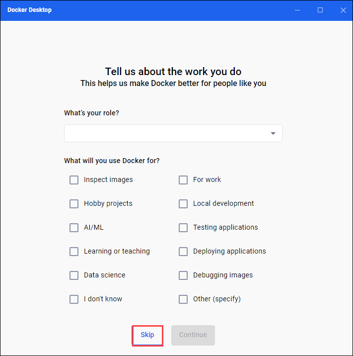
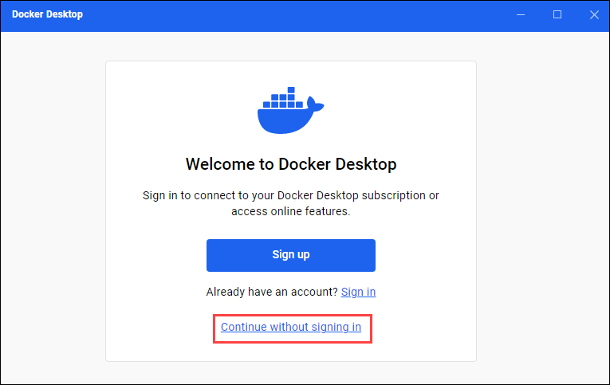
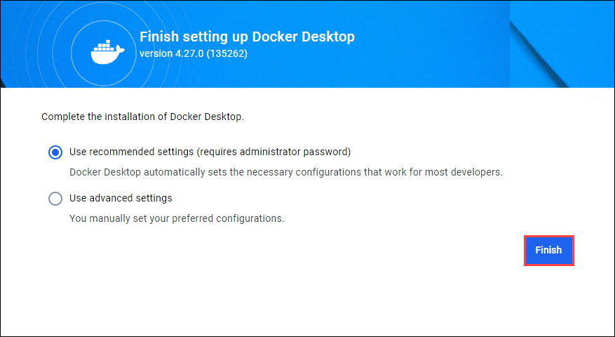
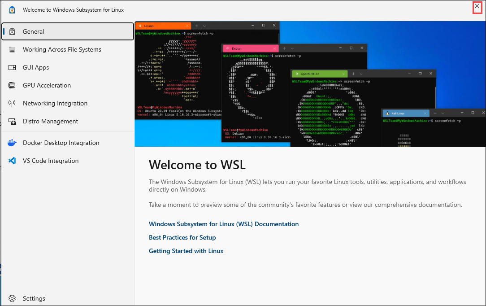
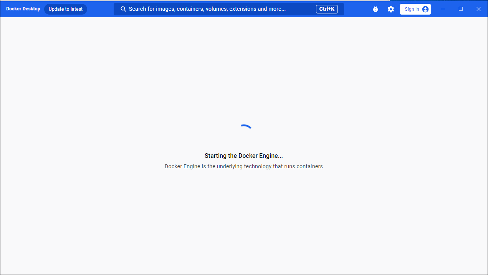
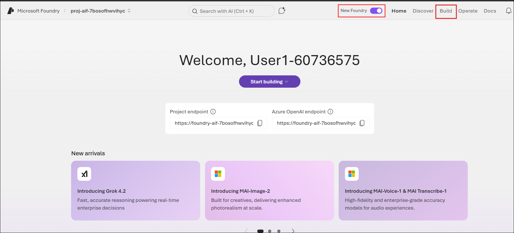

# Usecase 2- Building multi agent AI solution for streamlining Healthcare prior authorization workflows 

## Overview

In today’s rapidly evolving digital landscape, enterprises like
**Contoso Ltd.** face increasing pressure to streamline operations,
improve decision-making, and scale intelligent automation across
departments. Traditional automation approaches often fall short when
dealing with **complex, cross-functional workflows**, where multiple
systems, teams, and data sources must be coordinated efficiently.

To address these challenges, Contoso adopts the **Multi-Agent Solution
Accelerator**, an advanced AI-driven framework that leverages multiple
specialized agents working collaboratively to execute business
processes.

This accelerator enables organizations to design **intelligent,
agent-based workflows**, where each AI agent is responsible for a
specific function—such as data retrieval, reasoning, validation, and
execution. These agents operate in a coordinated manner, orchestrated
through a central system that interprets user requests and dynamically
assigns tasks.

Built on modern cloud technologies like **Azure OpenAI Service**,
**Azure Cosmos DB**, and containerized microservices, the solution
provides a scalable and extensible foundation for enterprise AI
applications.

**Business Scenario**

Contoso operates across multiple business units including **supply
chain, finance, customer service, and compliance**. Each department
relies on different systems and processes, resulting in:

- Fragmented workflows across departments

- Manual coordination causing delays and inefficiencies

- High risk of human errors in decision-making

- Limited scalability of automation initiatives

To overcome these challenges, Contoso implements a **multi-agent AI system** where:

**Multi-Agent Workflow**

1. **User Request Intake Agent**  
    Captures business queries (e.g., "Approve supplier contract" or
    "Analyze sales performance").

2. **Planning Agent**  
    Breaks down the request into smaller executable tasks.

3. **Data Retrieval Agent**  
    Fetches relevant data from enterprise systems (ERP, CRM, data
    warehouses).

4. **Reasoning Agent**  
    Applies AI models to analyze data and generate insights.

5. **Validation Agent**  
    Ensures accuracy, compliance, and business rule alignment.

6. **Execution Agent**  
    Triggers actions such as approvals, notifications, or report
    generation.

**Prerequisites**

- **GitHub Account**: You are expected to have your own GitHub login credentials. If you do not have an account, please create one by visiting: <https://github.com/signup

## Lab Objective

- Task 1: Register Service provider
- Task 2: Retrieve resource group name and location
- Task 3: Open Github Codespaces environment
- Task 4: Provision Services and deploy application to Azure
- Task 5: Verify deployed resources in the Azure portal
- Task 6: Test the Application

## Task 1: Register Service provider

1. In the Azure portal search bar, type **Subscriptions (1)**, then select **Subscriptions (2)** from the Services list to open it.

    

1. On the **Subscriptions** page, select the required subscription (e.g., **Sandbox AI DS**) from the list to open its details.

    

1. In the selected subscription, navigate to **Settings (1)**, select **Resource providers (2)**, search for **Microsoft.CognitiveServices (3)**, and select it from the **list (4)** and verify that the status is registered with a green tick.

    

1. Similarly, search for the following resource providers and verify that the status is registered with a green tick.

    - **Microsoft.AlertsManagement**

    - **Microsoft.App**

    - **Microsoft.ContainerRegistry**

    - **Microsoft.OperationalInsights**

    - **Microsoft.Insights**

## Task 2: Retrieve resource group name and location

1. In the Azure portal search bar, type **Resource groups (1)**, then select **Resource groups (2)** from the Services list to open it.

    .png)

1. In **Resource group** page, copy **resource group name and location** and paste them in a notepad, then **Save** the notepad to use the information in the upcoming tasks.

    .png)

## Task 3: Open Github Codespaces environment

> **Note:** You are expected to have your own GitHub login credentials. If you do not have an account, please create one by visiting below shared URL: 
   
   ```
   https://github.com/signup?user_email=&source=form-home-signup
   ```
   
1. Open your browser, navigate to the address bar, type or paste the following URL: 

    ```
    https://github.com/technofocus-pte/MultiAIAgentAccelerator
    ```

1. Click on **Fork** (top-right corner) and select **Create a new fork** to create your own copy of the repository.

    .png)

1. And give a unique name to the repo and click on **Create fork** button.

     

1. Click on **Code (1)**, switch to the **Codespaces (2)** tab, and select **Create codespace on main (3)** to launch the development environment.

     

    > If the "This site is trying to open Visual Studio Code" pop-up appears, click **Cancel**.

1. Click the highlighted Back button to navigate back to the previous Github page.

    .png)

1. Select the **Code (1)** dropdown and navigate to the **Codespaces (2)** tab, select the **ellipsis menu(3)** and choose **Open in Browser (4)**

    .png)

1. Wait for the Codespaces environment to setup. It takes few minutes to setup completely.

    

    

1. The environment is now ready for resource deployment.

    

## Task 4: Provision Services and deploy application to Azure

1. In the LabVM search bar, type **Docker (1)** and select **Docker Desktop (2)** from the results to open the application.

    

    > **Note:** Before moving on to the next steps please make sure your Docker Desktop is up and running. It should not be in stopped state.

1. Click **Accept** to agree to the Docker Subscription Service Agreement and continue.

    

1. Click **Skip** to bypass the setup questionnaire and proceed.

    

1. Click **Continue without signing in** to proceed without logging into Docker.

    

1. Select **Use recommended settings** and click **Finish** to complete the Docker Desktop setup.

      

1. Click the **Close (X)** button to exit the Windows Subsystem for Linux (WSL) welcome screen.

    

1. Wait for Docker Desktop to finish starting the Docker Engine before proceeding.

         

1. Navigate back to the Codespace and run the following command on the Terminal. It generates the code to copy. Copy the code and press Enter.

    ```
    azd auth login
    ```

    

1. Run the azd auth login command, copy the displayed authentication code, and complete the sign-in process in your browser to authenticate your environment.

    

1. Default browser opens to enter the generated code to verify. Enter the code and click **Next**.

     

1. Sign in with your Azure credentials.

    

    

    

1. Run the az login command, copy the displayed authentication code, and complete the sign-in process in your browser to authenticate your environment.

    ```
    azd login
    ```

    

    

    

    .png)

    

1. Run azd up - This will provision Azure resources

    ```
    azd up
    ```

    

1. Enter any name of your choice and press enter (eg:**prior-auth-devXXXX**)

    

    

1. Select below values.

    - **Select an Azure Subscription to use** : Select your subscription

    - **Enter a value for existingResourceGroup Name:** existing resource group

    - **Enter location**: Sweden Central

      

      

      

1. Enter **Y** to proceed with the deployment.

    

    

    

    

1. The deployment process is currently building container images using a remote Azure Container Registry (ACR) build.

    

    

1. The frontend container image has been built successfully, and the agent-clinical image build process has started in Azure Container Registry (ACR).

    

1. Agent-clinical image build process completed and building agent-coverage build process has started in Azure Container Registry (ACR).

    

1. Agent-coverage image build process completed and building agent-compliance build process has started in Azure Container Registry (ACR).

     

1. Agent-compliance image build process completed and building agent-synthesis build process has started in Azure Container Registry (ACR).

    

1. Agent-synthesis image build process completed

    

1. Backend and frontend container app updated successfully

     

1. The agent-synthesis image has been built successfully, container apps have been updated, required roles have been ensured, and Foundry MCP tool connections have been created successfully.

     

1. The deployment has completed successfully, and the frontend and backend application URLs, along with the backend health check endpoint, are now available for access.

     

## Task 5: Verify deployed resources in the Azure portal

1. Select **Resource groups**

    

1. Click on your assigned **Resource group**.

    

1. Make sure the below resource got deployed successfully

    - Foundry

    - Foundry project

    - Container App

    - Container registry

    - Container App Environment

    

1. Click on **Foundry Project.**

    

1. Click **Go to Foundry portal** to verify that the agents has been
    successfully deployed.

    

1. In Microsoft Foundry, enable the **New Foundry** option and navigate to the **Build** section from the top
    menu to start creating and managing your AI solutions.

    

1. Agents has been successfully deployed

    

1. Select the **synthesis-agent**.

    

1. Click on **Start agent deployment** to deploy the synthesis-agent.

    

    

1. Select the **compliance-agent**.

    

1. Click on **Start agent deployment** to deploy the **compliance-agent**.

    

    

1. Repeat steps 10 and 11 to run the **coverage-assessment-agent** and **clinical-reviewer-agent**.

    

    

          

   ### Congratulations!

   You’ve completed the task. Now let’s validate it:
     
   - Hit the **Validate** button for the corresponding task.
   - If successful, proceed to the next task.
   - If not, retry using the lab guide.
   - Need help? cloudlabs-support@spektrasystems.com
   <validation step="7a657a19-9fda-4427-bf5b-4929e924c67c" />

## Task 6: Test the Application

1. Go back to the codespace and copy the **Frontend URL**; it will be used later to launch the application.

    

1. Run the following command to verify agent connections and application health status.

    ```
    python scripts/check_agents.py
    ```

    

    

1. Run the check_agents.py script to verify agent registration, backend health, frontend availability, and tool connections, ensuring all checks pass successfully before proceeding with PA request submission.

    ```
    python scripts/check_agents.py --version 1
    ```

    

1. Run the check_agents.py --poll command to continuously monitor agent status, ensuring all components like registration, tool connections, backend health, and frontend availability remain healthy before submitting PA requests.

    ```
    python scripts/check_agents.py --poll
    ```

    

1. Click on **Frontend**

    

1. Click on **Open** button

    

    

1. Click **"Load Sample Case"** to populate the form with demo data

    

1. Click **"Submit for Review"**

    

1. Monitor the progress tracker — you should see all 5 phases complete

    

    

1. Review the agent results in the dashboard tabs (Compliance, Clinical, Coverage)

    

1. Click **Accept Recommendation**

    

    

    

           

   ### Congratulations!

   You’ve completed the task. Now let’s validate it:
     
   - Hit the **Validate** button for the corresponding task.
   - If successful, proceed to the next task.
   - If not, retry using the lab guide.
   - Need help? cloudlabs-support@spektrasystems.com
   <validation step="0cd5f7a0-43ba-4390-88dd-e8f7a18e6a7e" />

## Summary

In this usecase, you successfully built and deployed a **multi-agent
AI-powered healthcare solution** that automates prior authorization
workflows. By integrating multiple intelligent agents, the system
reduces manual intervention, improves operational efficiency, and
ensures accurate, compliant decision-making.

The hands-on experience covered:

- Setting up Azure resources and permissions

- Deploying containerized AI agents

- Orchestrating agent collaboration

- Testing the application with real scenarios

Overall, this use case demonstrates how **multi-agent AI systems can
transform complex healthcare processes** into efficient, scalable, and
intelligent workflows, providing a strong foundation for enterprise AI
adoption.
