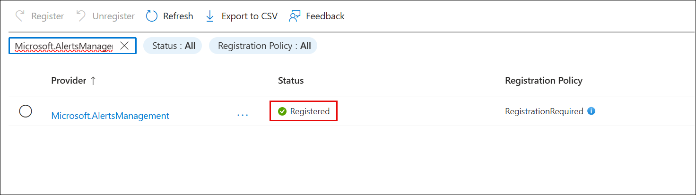
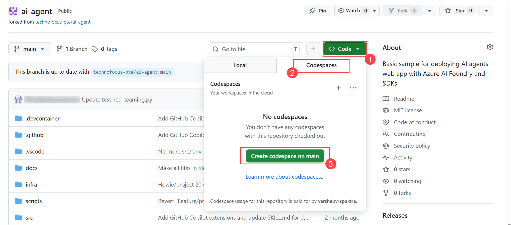
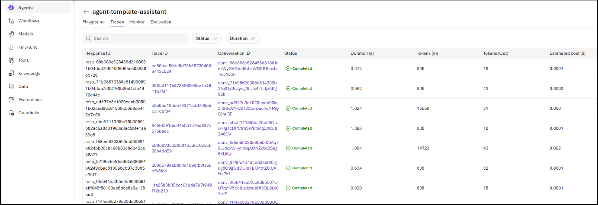

# Usecase 08 - Safeguard your agents with AI Red Teaming Agent in Microsoft Foundry

## Scenario

Zava is a fast-growing technology and services company that manages large volumes of internal documentation, product manuals, training material, and customer-support knowledge. Employees frequently need quick, accurate responses without manually searching through dozens of files and knowledge repositories.

To improve efficiency, Zava wants to deploy an intelligent AI-powered assistant that can read, understand, and retrieve answers from its internal documents. The company chooses Azure AI Agent Service to build an interactive chat interface, where employees can simply ask a question and receive a precise, citation-supported answer grounded in Zava's internal knowledge.


## Introduction

As organizations adopt AI agents to automate workflows, answer questions, and retrieve internal knowledge, ensuring these systems
behave safely and reliably becomes critical. Zava, a fast-growing technology company, is deploying an internal AI knowledge assistant to help employees quickly retrieve information from documents, manuals, and
training materials. To protect this AI agent against harmful behavior, security gaps, or unintended responses, Zava leverages Microsoft Foundry's AI Red Teaming capabilities.

This use case demonstrates how to build a secure end-to-end AI agent, evaluate its behavior, detect risks through automated red teaming, and monitor its performance using Azure's observability tools. Through guided steps, you will deploy the agent, test its retrieval capabilities, run red teaming evaluations, and enforce continuous monitoring to ensure safety, accuracy, and compliance.

## Objectives

- Understand how to build a document-aware AI knowledge assistant using Azure AI Agent Service.

- Deploy Azure resources and configure the full solution using Azure Developer CLI.

- Interact with the AI agent using predefined and custom prompts to validate retrieval accuracy.

- Execute built-in evaluators to measure agent quality, safety, intent resolution, and tool-call correctness.

- Run automated AI Red Teaming tests to identify vulnerabilities, harmful behaviors, or safety violations.

- Analyze red teaming results in Microsoft Foundry, including attack strategies and failure cases.

- Enable tracing, monitoring, and continuous evaluation to track real-time agent behavior in production.

- Learn best practices for securing AI agents through consistent testing, observability, and model governance.

## Task 1: Register Service provider

1. Navigate to https://portal.azure.com/ and if asked login with the credentials

1. In the Azure portal search bar, type **Subscriptions** (1), then select **Subscriptions (2)** from the list to open it.

    

1. On the **Subscriptions** page, select the required subscription (e.g., **Sandbox AI DS**) from the list to open its details.

    

1. In the selected subscription, navigate to **Settings (1)**, select **Resource providers (2)**, search for **Microsoft.CognitiveServices (3)**, and select it from the **list (4)** and verify that the status is registered with a green tick.

    

1. Similarly, search for **Microsoft.AlertsManagement** and verify that the status is registered with a green tick.

    

## Task 2: Open Github Codespaces environment

> **Note:** You are expected to have your own GitHub login credentials. If you do not have an account, please create one by visiting below shared URL: 
   
   ```
   https://github.com/signup?user_email=&source=form-home-signup
   ```

1. In a new tab, enter the following URL to open the GitHub repository, then click on **fork** to fork the repo.

   ```
   https://github.com/technofocus-pte/ai-agent.git
   ```

    

1. On Create a new fork page, keep everything as default and click on **Create fork** button.

    

1. Click **Code (1)**, go to the **Codespaces (2)** tab, and select **Create codespace on main (3)** to launch the environment.

    

1. Wait for the Codespaces environment to setup .It takes few minutes to setup completely.

    

    

    > **Note:** It can take a few minutes for the codespace to spin up completely

## Task 3: Provision Services and deploy application to Azure

1. In the LabVM search bar, type **Docker (1)** and select **Docker Desktop (2)** from the results to open the application.

    

    > **Note:** Before moving on to the next steps please make sure your Docker Desktop is up and running. It should not be in stopped state.

1. Click **Accept** to agree to the Docker Subscription Service Agreement and continue.

    

1. Select **Use recommended settings** and click **Finish** to complete the Docker Desktop setup.

    

1. Click **Continue without signing in** to proceed without logging into Docker.

    

1. Click **Skip** to bypass the setup questionnaire and proceed.

      

1. Wait for Docker Desktop to finish starting the Docker Engine before proceeding.

    

    >**Note:** It may take a few minutes to complete the setup. Please wait until the process finishes.     

    >**Note:** Click the **Close (X)** button to exit the Windows Subsystem for Linux (WSL) welcome screen.

1. Navigate back to the Codespace in the in the browser, run the following command in the Terminal and press Enter.

    ```
    azd auth login
    ```

    

1. Copy the displayed authentication code from the terminal, press **Enter**, and complete the Azure login in the browser.

    

1. Enter the displayed code in the field and click **Next** to proceed with authentication.

    

1. Select your account ODL user account to continue signing in to Azure CLI.

    

1. Click **Continue** to confirm and complete the sign-in to Microsoft Azure CLI.

    

1. Verify that authentication is successful (logged in message appears), then proceed with the next command in the terminal.

    

1. Run the following command in the terminal to create a new environment.

   - Enter a unique environment name as **ai-agent-<inject key="DeploymentID" enableCopy="false"/>** when prompted and press **Enter**.

      ```
      azd env new
      ```

      

1. Run azd up - This will provision Azure resources

    ```
    azd up
    ```

    

1. Select below values.

    - **Select an Azure Subscription to use** : Select your subscription

    - **azureAiServiceLocation**: East US 2, East US, West US , West US 3 , Sweden Central 

    >**Note** - If it throws quota issue try with other location

    >**Note:** If prompted with **“Would you like to check your Azure development tools? [Y/n]”**, type **n** and press **Enter** to skip the check and continue with the setup. 

      

1. This deployment will take *10-15 minutes* to provision the resources in your account and set up the solution with sample data.

1. You can monitor the deployment progress using the provided Azure Portal link until provisioning completes.

    

1. After the application has been successfully deployed, you see a URL displayed in the terminal. Copy the **Endpoint URL**

    

## Task 4: Verify deployed resources in the Azure portal

1. In the Azure portal search bar, type **Resource groups** and select **Resource groups** from the results.

    

1. From the **Resource groups** list, select the newly created resource group with prifix **rg-ai-agent-<inject key="DeploymentID" enableCopy="false"/>** to open it.

    

1. Make sure the below resources got deployed successfully:

    - Foundry  
    - Foundry project  
    - Application Insights  
    - Container App  
    - Container Apps Environment  
    - Container registry  
    - Managed Identity  
    - Log Analytics workspace  
    - Storage account  


      

1. In the resource group and click on **Azure Storage account.**

    

1. From the left navigation menu, click on **Containers** under **Data storage**, Make sure data should be deployed successfully

    

1. Go back to resorcegroup and click on **Foundry Project.**

    

1. Click **Go to Foundry portal** to verify that the model has been successfully deployed, it will navigate you to the **Microsoft Foundry** tab in your browser.

    

1. Copy the **Project endpoint** and save it for future use, as it is required while configuring the application and connecting to the Azure AI Project in subsequent steps.

    

1. In the top navigation, select **Build.**

    

1. From the left menu, click **Agents (1)**, then select the **agent-template-assistant (2)** agent from the list to open it.

    

## Task 5: Interact with Your AI Agent Using Predefined Questions

1. Go back to GitHub Codespaces and select the **Endpoint URL**.

    

1. Click on **Open** button

    

1. Wait for the web application deployment to complete.

    

1. In the **agent-template-assistant** web app page, enter the following prompt and click on the **Submit icon** as shown in the below image.

    ```
    What's the best tent under $200 for two people, and what features does it include?
    ```

    

    

1. In the **agent-template-assistant** web app page, enter the following prompt and click on the **Submit icon** as shown in the below image.

   ```
   What has David Kim purchased in the past, and based on his buying patterns, what other products might interest him?
   ```

    

    

1. In the **agent-template-assistant** web app page, enter the following prompt and click on the **Submit icon** as shown in the below image.

    ```
    Compare hiking boots from different brands in your inventory - which ones offer the best value for durability and comfort?
    ```

    

    

1. In the **agent-template-assistant** web app page, enter the following prompt and click on the **Submit icon** as shown in the below image.

   ```
   How do I set up the Alpine Explorer Tent, and what should I know about its weather protection features?
   ```

    

    

4. In the **agent-template-assistant** web app page, enter the following prompt and click on the **Submit icon** as shown in the below image.

   ```
   I'm planning a 3-day camping trip for my family. What complete setup would you recommend under $500, and why?
   ```

    

    

## Task 6: Sample Prompts for Azure AI Search

1. In the **agent-template-assistant** web app page, select **New Chat.**

    

2. In the **agent-template-assistant** web app page, enter the following prompt and click on the **Submit icon** as shown in the below image.

   ```
   Which products have wireless charging capabilities and what are their battery life specifications?
   ```

    

    

1. In the **agent-template-assistant** web app page, enter the following prompts and review the response.

    ```
    Find products designed for comfort and temperature control - what features do they offer?
    ```

    ```
    What care and maintenance instructions are available for electronic products with waterproof features?
    ```

    

## Task 7: Agent Evaluation

Microsoft Foundry offers a number of built-in evaluators to measure the quality, efficiency, risk and safety of your agents. For example, intent resolution, tool call accuracy, and task adherence evaluators are
targeted to assess the end-to-end and tool call process quality of agent workflow, while content safety evaluator checks for inappropriate content in the responses such as violence or hate. You can also create custom evaluators tailored to your specific requirements, including custom prompt-based evaluators or code-based evaluators that implement your unique assessment criteria.

1. Go back to **GitHub Codespaces**, open the terminal, and run the Python requirements script below to set up your environment

   ```
   python -m pip install -r src/requirements.txt
   ```

    

    

    
    > **Note:** If you encounter dependency conflict errors during installation, run the following commands to remove the conflicting package and reinstall the required dependencies:
    >
    > ```bash
    > pip uninstall api -y
    > python -m pip install -r src/requirements.txt
    > ```


1. Run the below script to set the variable.

    ```
    export AZURE_AI_AGENT_DEPLOYMENT_NAME="gpt-5-mini"

    export AZURE_EXISTING_AGENT_ID="agent-template-assistant:1"

    export AZURE_AI_AGENT_NAME="agent-template-assistant"
    ```

1. Select the **test_utils.py** under the **test** folder in the left hand panel.

1. Paste the endpoint that you copied in **Task 4 and Step 8** between the empty double quotes **""** on line 40 after **AZURE_EXISTING_AIPROJECT_ENDPOINT**.

1. Run the below script below

    ```
    export AZURE_EXISTING_AIPROJECT_ENDPOINT="Paste you AZURE_EXISTING_AIPROJECT_ENDPOINT here"
    ```
    >**Note**- Don't forget to paste your endpoints in the command before running it

1. Run the below script below.

    ```
    pytest tests/test_evaluation.py -s
    ```

    

1. Upon completion, the test will display an URL in the output where you can review the detailed evaluation results in the Microsoft Foundry UI, including individual evaluator passing scores and explanations.

    

1. Click on the **Open**

    

    
## Task 8: AI Red Teaming Agent

The AI Red Teaming Agent is a powerful tool designed to help organizations proactively find security and safety risks associated with
generative AI systems during design and development of generative AI models and applications.

In the red teaming test script, you will be able to set up an AI Red Teaming Agent to run an automated scan of your agent in this sample. The test demonstrates how to:

- Create a red-teaming evaluation

- Generate taxonomies for risk categories (e.g., prohibited actions)

- Configure attack strategies (Flip, Base64) with multi-turn
  conversations

- Retrieve and analyze red teaming results

No test dataset or adversarial LLM is needed as the AI Red Teaming Agent
will generate all the attack prompts for you.

1. Run the below script to set the variable

    ```
    export AZURE_EXISTING_AGENT_ID="agent-template-assistant:1"
    ```

1. Run the red teaming test in your local development environment:

    ```
    pytest tests/test_red_teaming.py -s
    ```

    

    

1. Upon completion, the test will display an URL in the output where you can review the detailed red teaming evaluation results in the Microsoft Foundry UI, including attack inputs, outcomes, and reasons.

    

1. Click on **Open** button

    

    

## Task 9: Tracing and monitoring

1. Enable tracing by setting the environment variable

    ```
    azd env set ENABLE_AZURE_MONITOR_TRACING true
    ```

1. Deploy the resources

    ```
    azd deploy
    ```

    

    

    

## Task 10: Console traces

1. You can view console traces in the Azure portal by executing the below command. You can get the link to the resource group with the azd tool:

    ```
    azd show
    ```

    

    >**Note:** Choose your container app from the list of resources in the resource group. Then open 'Monitoring' and 'Log Stream'. Choose the 'Application' radio button to view application logs. You can choose between real-time and historical using the corresponding radio buttons. Note that it may take some time for the historical view to be updated with the latest logs.

## Task 11: Agent traces and Monitor

You can view both the server-side and client-side traces, cost and
evaluation data in Microsoft Foundry.

1. Go back the Microsoft Foundry and From the left navigation pane, select **Agents (1)**, and then click on **agent-template-assistant (2)** from the list to open the agent details..

    

1. Select the **Traces**

    

    

1. Click on the **Monitor** tab to view the agent’s performance metrics and activity.

    

1. Scroll down in the **Monitor tab**, and check the **Operational metrics** section.

    

    

## Task 12: Continuous Evaluation

Continuous evaluation is an automated monitoring capability that continuously assesses your agent's quality, performance, and safety as it handles real user interactions in production.

During container startup, continuous evaluation is enabled by default and pre-configured with a sample evaluator set to evaluate up to 5 agent responses per hour. Continuous evaluation does not generate test
inputs-instead, it evaluates real user conversations as they occur. This means evaluation runs are triggered only when actual users interact with your agent, and if there are no user interactions, there will be no evaluation entries.

To customize continuous evaluation from the Microsoft Foundry:

1. Select **Monitor(1)** Choose the agent you want to enable continuous evaluation for from the agent list and click on **Settings (2)**

    

1. In the **Monitor settings** pane, enable **Continuous evaluation (1)**, set **Maximum runs per hour** to **1** **(2)**, and then click **Submit (3)**.
    

    

## Summary

In this use case, you built and secured an AI agent capable of retrieving information from Zava's internal documents using Azure AI Agent Service. After deploying the environment and verifying key resources-including Container Apps, Azure Cosmos DB, Storage, Search, and Foundry-you interacted with the agent to test its ability to answer operational and product-related queries. You then performed automated evaluations using Microsoft Foundry's assessment tools and executed comprehensive AI Red Teaming scans to uncover potential risks. Finally, you enabled tracing, logging, and continuous evaluation to monitor real-world usage and ongoing model safety. This end-to-end workflow equips Zava with a reliable, secure, and scalable AI assistant that provides accurate information while meeting enterprise-grade safety and governance standards.
