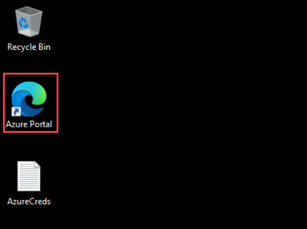
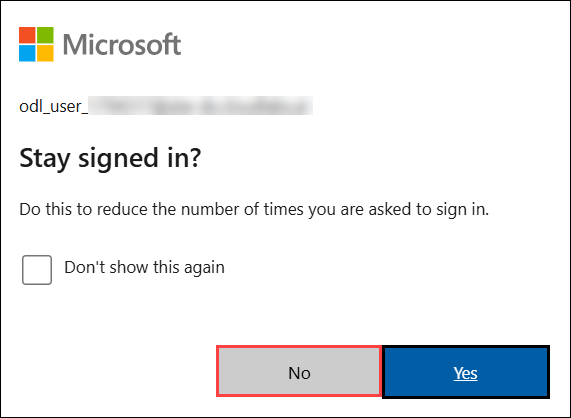

# Hands-on Labs - Day 1

# Architect intelligent agents with Microsoft IQ and Foundry

## Overall Estimated Duration: 4 Hours

## Overview

This lab demonstrates how Azure AI services can be combined to build enterprise AI solutions across multiple business scenarios. It covers three patterns: a HR knowledge assistant for policy retrieval, a multi-agent solution for healthcare prior authorization, and an enterprise automation framework for cross-functional workflows.

In the first scenario, you will build a Copilot Studio knowledge assistant that uses Azure AI Search and Azure OpenAI to retrieve information from HR documents through semantic and vector-based search. In the second, you will deploy a multi-agent AI solution that coordinates specialized agents to automate a healthcare prior authorization workflow. In the third, you will explore a broader orchestration framework designed for business processes such as onboarding, support, marketing, RFP analysis, and compliance review.

Across these scenarios, the lab shows how Azure AI Search, Azure OpenAI Service, Microsoft Copilot Studio, Azure Container Apps, Azure Cosmos DB, Azure App Service, Azure Storage, GitHub Codespaces, and Microsoft Foundry can be used together to build scalable, enterprise-ready AI applications.

## Objective

By the end of this lab, participants will be able to:

- Create and configure Azure AI Search, Azure Storage, and Azure OpenAI resources for AI-powered applications,

- Build a Copilot Studio knowledge assistant and connect it to Azure AI Search,

- Create a vector index and enable retrieval-augmented generation over enterprise documents,

- Deploy and validate a containerized multi-agent workflow using GitHub Codespaces and Azure Developer CLI,

- Provision and verify the Azure resources required for enterprise AI automation,

- Configure post-deployment settings such as authentication and sample data,

- Test AI-driven scenarios to observe how specialized agents work together to complete business tasks.

## Pre-requisites

Participants should have:

- An active Azure subscription with permission to create and manage resources,

- A valid GitHub account to fork the repository and use GitHub Codespaces,

- Access to Microsoft Copilot Studio and Microsoft Foundry,

- The required Azure resource providers registered in the subscription,

- Docker Desktop installed for container-based deployment tasks,

- Access to Azure and GitHub credentials for authentication during setup and deployment.

## Explanation of Components

The architecture for this lab involves the following key components:

1. Azure AI Search
Azure AI Search is used to index enterprise documents and enable fast, semantic retrieval.

   - Serves as the search layer for the HR knowledge assistant.
   - Supports vector-based search over enterprise documents.

1. Azure OpenAI Service
Azure OpenAI Service provides the language and embedding models used in the lab.

   - Supports document embedding and semantic retrieval.
   - Enables natural language reasoning and AI-generated responses.

1. Microsoft Copilot Studio
Microsoft Copilot Studio is used to create the HR knowledge assistant.

   - Allows the assistant to be built and tested.
   - Connects Azure AI Search as a knowledge source.

1. Azure Storage Account
Azure Storage Account stores the source documents used in the lab.

   - Stores HR policy and enterprise documents.
   - Supports ingestion and indexing workflows.

1. Azure Container Apps
Azure Container Apps hosts the containerized agent services.

   - Provides a managed environment for agent deployment.
   - Supports scalable execution of AI workflows.

1. Azure Container Registry
Azure Container Registry stores the container images used by the solution.

   - Maintains deployment artifacts for backend services.
   - Supports containerized application deployment.

1. Azure Cosmos DB
Azure Cosmos DB provides scalable NoSQL storage for workflow data.

   - Stores application state and workflow context.
   - Supports coordination between multiple AI agents.

1. Azure App Service
Azure App Service hosts the frontend web application.

   - Provides the user-facing interface for enterprise workflows.
   - Supports authentication and application access.

1. GitHub Codespaces
GitHub Codespaces provides the cloud-based development environment used in the lab.

   - Used to execute deployment and provisioning commands.
   - Simplifies setup with a ready-to-use workspace.

1. Microsoft Foundry
Microsoft Foundry is used to deploy and manage AI models and related assets.

   - Supports model deployment and verification.
   - Provides access to deployed AI endpoints and resources.

1. Multi-Agent Framework
The multi-agent framework enables specialized AI agents to collaborate on business workflows.

   - Supports planning, retrieval, validation, and execution tasks.
   - Enables automation across enterprise scenarios.

1. Vector Index
The vector index stores embeddings generated from enterprise documents.

   - Enables semantic and similarity-based retrieval.
   - Forms the foundation for RAG-based search behavior.

## Getting Started with the lab

Welcome to your Accelerate Agentic AI for Frontier Workshop, Let's begin by making the most of this experience.

## Accessing Your Lab Environment

Once you're ready to dive in, your virtual machine and **Guide** will be right at your fingertips within your web browser.

## Virtual Machine & Lab Guide

Your virtual machine is your workhorse throughout the workshop. The lab guide is your roadmap to success.

## Lab Guide Zoom In/Zoom Out

To adjust the zoom level for the environment page, click the **A↕ : 100%** icon located next to the timer in the lab environment.

## Exploring Your Lab Resources

To get a better understanding of your lab resources and credentials, navigate to the **Environment** tab.

## Utilizing the Split Window Feature

For convenience, you can open the lab guide in a separate window by selecting the **Split Window** button from the Top right corner.

## Managing Your Virtual Machine

Feel free to **Start, Stop, or Restart (2)** your virtual machine as needed from the **Resources (1)** tab. Your experience is in your hands!

## Let's Get Started with Azure Portal

1. On your virtual machine, click on the Azure Portal icon.

    

2. You'll see the **Sign into Microsoft Azure** tab. Here, enter your **credentials (1)** and select **Next (2)**:

   - **Email/Username:** <inject key="AzureAdUserEmail"></inject>

     

3. Next, provide your **password (1)** and select **Sign In (2)**:

   - **Password:** <inject key="AzureAdUserPassword"></inject>

     

      >**Note:** If you see **Temporary Access pass**, enter the the password and select **Sign In (2)**:

       - Enter **Temporary Access Pass:** <inject key="AzureAdUserPassword"></inject> **(1)**

          

4. If **Action required** pop-up window appears, click on **Ask later**.
5. If prompted to **stay signed in**, you can click **No**.

    

6. If a **Welcome to Microsoft Azure** pop-up window appears, simply click **"Cancel"** to skip the tour.

## Steps to Proceed with MFA Setup if "Ask Later" Option is Not Visible

1. At the **"More information required"** prompt, select **Next**.

1. On the **"Keep your account secure"** page, select **Next** twice.

1. **Note:** If you don’t have the Microsoft Authenticator app installed on your mobile device:

   - Open **Google Play Store** (Android) or **App Store** (iOS).
   - Search for **Microsoft Authenticator** and tap **Install**.
   - Open the **Microsoft Authenticator** app, select **Add account**, then choose **Work or school account**.

1. A **QR code** will be displayed on your computer screen.

1. In the Authenticator app, select **Scan a QR code** and scan the code displayed on your screen.

1. After scanning, click **Next** to proceed.

1. On your phone, enter the number shown on your computer screen in the Authenticator app and select **Next**.
1. If prompted to stay signed in, you can click "No."

1. If a **Welcome to Microsoft Azure** pop-up window appears, simply click "Maybe Later" to skip the tour.

## Support Contact

The CloudLabs support team is available 24/7, 365 days a year, via email and live chat to ensure seamless assistance at any time. We offer dedicated support channels tailored specifically for both learners and instructors, ensuring that all your needs are promptly and efficiently addressed.

Learner Support Contacts:

- Email Support: [cloudlabs-support@spektrasystems.com](mailto:cloudlabs-support@spektrasystems.com)
- Live Chat Support: https://cloudlabs.ai/labs-support

Click **Next** from the bottom right corner to embark on your Lab journey!

Now you're all set to explore the powerful world of technology. Feel free to reach out if you have any questions along the way. Enjoy your workshop!